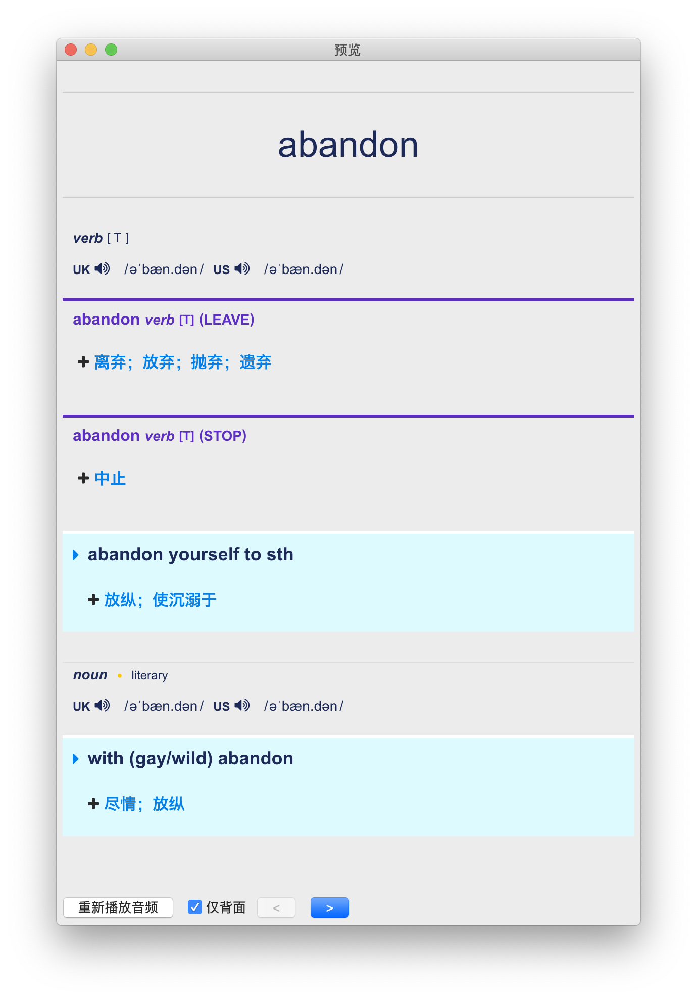

# 简介

将单词批量转换为 Anki 卡片，数据来源[剑桥词典](https://dictionary.cambridge.org/zhs/%E8%AF%8D%E5%85%B8/%E8%8B%B1%E8%AF%AD-%E6%B1%89%E8%AF%AD-%E7%AE%80%E4%BD%93/)

macOS 端预览：



手机端预览：


# 使用环境

- [Python3](https://www.python.org/)

- 网络

# 使用方法

  1. 准备单词文件

  以换行分隔，重复单词和无效单词（包括字典上没有的）将被忽略，例如`vocabulary.txt`:

  ```
  dread
  dreadful
  handicap
  competitor
  competition
  competitive
  competitiveness
  ```

  2. 运行脚本

  使用`-i`参数指定输入单词文件：

  ```sh
  python3 dict2anki.py -i vocabulary.txt
  ```

  默认在当前目录下生成文件`style.css`和`anki.txt`。

  注：

    1. 被跳过的单词在脚本运行后会有提示
    2. `anki.txt`以追加形式增加内容，可以多次运行脚本以便输入到同一`anki.txt`文件，但不会去除多次输入文件之间重复的单词
    3. 国内访问剑桥词典可能速度不佳

  3. 新建模板

  打开桌面版 Anki，`工具`——`管理笔记类型`——`添加`——`基础`，输入名称，例如`基础单词`，选中`基础单词`，点击右侧`卡片`，删除`格式刷`中的内容，改为`style.css`中的内容。

  4. 导入`anki.txt`

  创建所需记忆库，例如`英语单词`。

  `文件`——`导入`，选择`anki.txt`，`类型`选择刚刚新建的笔记类型`基础单词`，`牌组`选择`英语单词`，勾选`允许在字段中使用HTML`，点击`导入`。
